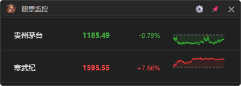

# 📊 股票监控 — A股实时行情悬浮窗

一个基于 **PyQt6** 的桌面悬浮窗工具，实时监控 A股（沪深）股票行情，每只股票一行，显示**名称 · 代码 · 现价 · 涨跌幅 · 迷你分时图**。


---

## 功能特点

- **悬浮窗设计** — 无边框、半透明、置顶显示，拖拽移动位置
- **实时行情** — 通过新浪财经 HTTP API 获取实时报价，默认 5 秒刷新
- **迷你分时图** — 每只股票右侧绘制当日分时走势，涨红跌绿一目了然
- **系统托盘** — 关闭时最小化到托盘，后台静默运行
- **开机自启** — 支持一键设置 Windows 开机自启动
- **灵活配置** — 自由添加/删除股票，调整刷新间隔，切换窗口置顶
- **深色主题** — 低调深色 UI，适合长时间挂屏

## 快速开始

### 环境要求

- Windows 7+
- Python 3.10+

### 安装依赖

```bash
# 创建虚拟环境（推荐）
python -m venv venv
source venv/Scripts/activate  # 或 venv\Scripts\activate

# 安装依赖
pip install -r requirements.txt
```

### 运行

```bash
python main.py
```

### 打包成独立 EXE

```bash
# 方式一：使用打包脚本
.\build.bat

# 方式二：手动执行 PyInstaller
venv\Scripts\pyinstaller.exe 股票监控.spec
```

打包后的可执行文件在 `dist/` 目录，可直接运行。

## 使用指南

### 基本操作

| 操作 | 说明 |
|------|------|
| **左键拖拽** | 拖动窗口任意位置 |
| **点击⚙** | 打开设置面板 |
| **右键窗口** | 弹出快捷菜单（删除股票 / 退出） |
| **关闭按钮** | 最小化到系统托盘 |
| **双击托盘图标** | 显示/隐藏窗口 |

### 设置面板

- **股票管理** — 输入股票代码（如 `600519`）添加，选中后删除
- **数据刷新** — 可选 3秒 / 5秒 / 10秒 / 30秒 / 60秒
- **窗口行为** — 开机自启动、窗口置顶

### 股票列表配置

在 `config.json` 中可手动编辑股票列表：

```json
{
    "stocks": [
        { "code": "600519", "name": "贵州茅台" },
        { "code": "300750", "name": "宁德时代" },
        { "code": "002594", "name": "比亚迪" },
        { "code": "688256", "name": "寒武纪" }
    ],
    "refresh_interval": 5,
    "window_x": 0,
    "window_y": 800,
    "opacity": 0.9,
    "auto_start": false,
    "always_on_top": true
}
```

| 字段 | 类型 | 说明 |
|------|------|------|
| `stocks` | array | 监控的股票列表，`code` 为 6 位代码，`name` 为中文简称 |
| `refresh_interval` | int | 行情刷新间隔（秒） |
| `window_x` / `window_y` | int | 窗口屏幕坐标（自动记忆） |
| `opacity` | float | 窗口透明度 0.0 ~ 1.0 |
| `auto_start` | bool | 是否开机自启动 |
| `always_on_top` | bool | 是否窗口置顶 |

## 项目结构

```
stock-watching/
├── main.py               # 程序入口
├── config.json            # 配置文件
├── requirements.txt       # Python 依赖
├── 股票监控.spec          # PyInstaller 打包配置
├── build.bat              # 一键打包脚本
├── README.md              # 本文件
│
├── ui/                    # 界面模块
│   ├── __init__.py
│   ├── main_window.py     # 主窗口（悬浮窗、托盘、定时器）
│   ├── stock_widget.py    # 股票行组件（价格、涨跌、迷你分时图）
│   └── settings_dialog.py # 设置对话框
│
├── data/                  # 数据模块
│   ├── __init__.py
│   └── fetcher.py         # 行情获取（新浪 API + akshare）
│
├── .gitignore             # Git 忽略规则（build/、dist/、venv/ 等）
├── build/                 # 打包临时文件（已 gitignore）
├── dist/                  # 打包输出目录（已 gitignore）
└── venv/                  # Python 虚拟环境（已 gitignore）
```

## 技术栈

| 组件 | 用途 |
|------|------|
| **PyQt6** | 桌面 GUI 框架 |
| **Qt** | 无边框窗口、拖拽、托盘、定时刷新 |
| **新浪财经 API** | 实时行情 HTTP 接口（免费，无需 Key） |
| **akshare** | 分时数据和 K 线数据（东方财富数据源） |
| **PyInstaller** | 打包为独立 EXE |

## 数据来源

- **实时行情** — [新浪财经](https://hq.sinajs.cn/) HTTP API（免费开放接口）
- **分时图 / K线** — [AKShare](https://github.com/akfamily/akshare) 开源金融数据接口（东方财富数据源）

> 注意：所有数据均来自公开免费 API，仅供个人学习和参考，不构成投资建议。

## 常见问题

**Q: 行情数据不刷新？**
A: 检查网络连接；新浪 API 在交易时段返回实时数据，非交易时段返回收盘数据。

**Q: 分时图显示为空？**
A: 非交易时段分时接口不返回数据，属于正常现象。

**Q: 如何开机自启动？**
A: 在设置面板勾选「开机自启动」即可；也可手动将 EXE 快捷方式放入 `shell:startup` 文件夹。

## License

MIT
